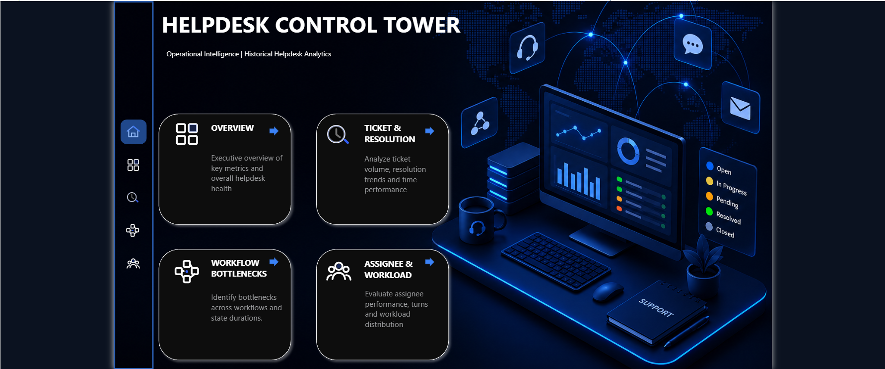
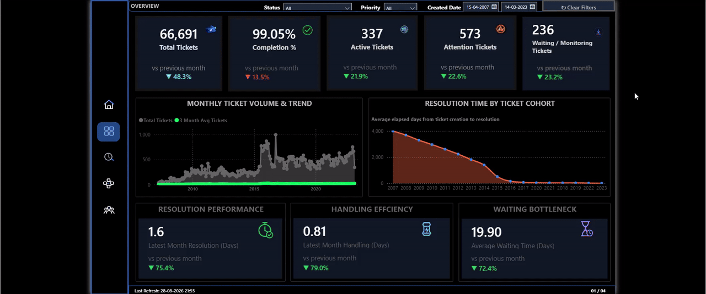
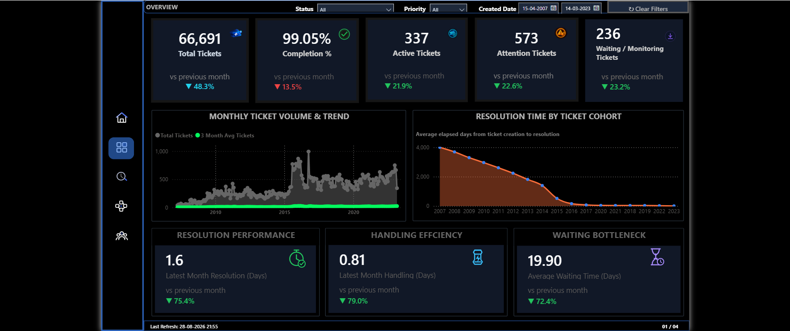
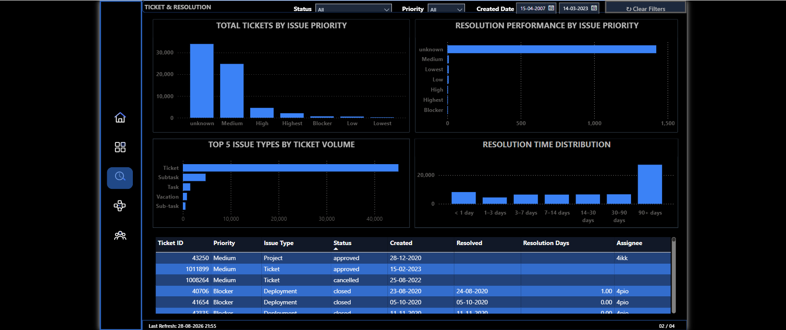
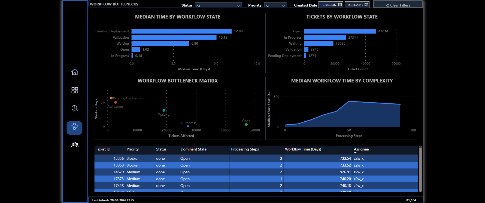
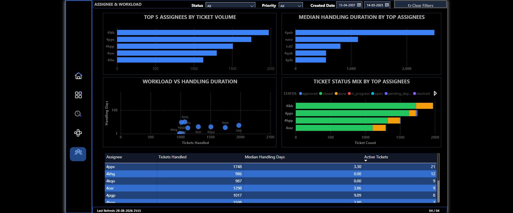

# Helpdesk Control Tower

A Power BI dashboard designed to analyze helpdesk ticket operations,
resolution performance, workflow bottlenecks, and assignee workload.

---

## 📊 Dashboard Demo

### Homepage



### Dashboard Walkthrough



---

## 📌 Project Overview

The Helpdesk Control Tower transforms raw helpdesk ticket data into an
interactive operational analytics dashboard.

The project focuses on four key areas:

- Ticket volume and operational trends
- Resolution and handling performance
- Workflow bottlenecks and waiting time
- Assignee workload and productivity

The dashboard is designed from an operations-management perspective, helping
identify workload concentration, resolution delays, active tickets,
attention-required tickets, and process bottlenecks.

---

## 🖥️ Dashboard Pages

### 1. Overview

Provides a high-level operational view of the helpdesk environment.



**Key KPIs**

- Total Tickets
- Completion %
- Active Tickets
- Attention Tickets
- Waiting / Monitoring Tickets
- Latest Month Resolution
- Latest Month Handling
- Average Waiting Time

**Key Visuals**

- Monthly Ticket Volume & Trend
- Resolution Time by Ticket Cohort
- Resolution Performance
- Handling Efficiency
- Waiting Bottleneck

---

### 2. Ticket Resolution

Focuses on ticket resolution performance and resolution-time patterns.



The page analyzes:

- Resolution duration
- Resolution trends
- Ticket cohorts
- Resolution performance
- Ticket volume by resolution period

---

### 3. Workflow Bottlenecks

Analyzes the different stages of the ticket workflow to identify delays,
waiting periods, and operational bottlenecks.



The analysis focuses on:

- Workflow stage duration
- Waiting time
- Processing time
- Bottleneck stages
- Tickets requiring monitoring or additional attention

---

### 4. Assignee & Workload

Analyzes workload distribution and handling performance across helpdesk
assignees.



**Key Visuals**

- Top 5 Assignees by Ticket Volume
- Median Handling Duration by Top Assignees
- Workload vs Handling Duration
- Ticket Status Mix by Top Assignees
- Assignee Performance Table

---

## 🛠️ Tools & Technologies

- Microsoft Power BI
- Power Query
- DAX
- Microsoft Excel
- Data Profiling
- Data Cleaning & Transformation
- Data Visualization
- Operational Analytics
- KPI Development

---

## 🔄 Data Preparation

The original helpdesk dataset required preprocessing before it could be used
effectively for dashboard analysis.

The data-preparation workflow included:

1. Data profiling
2. Data type validation
3. Date standardization
4. Missing and unknown value assessment
5. Workflow field transformation
6. Data cleaning
7. Creation of analytical views
8. DAX measure development
9. KPI validation
10. Loading transformed data into Power BI

Power Query was used as the primary data-transformation layer before the
cleaned analytical views were loaded into the Power BI model.

Detailed documentation is available in:

- [Data Dictionary](Documentation/Data_Dictionary.md)
- [Data Cleaning](Documentation/Data_Cleaning.md)
- [DAX Measures](Documentation/DAX_Measures.md)
- [KPI Definitions](Documentation/KPI_Definitions.md)

---

## 📈 Analytical Approach

The dashboard combines descriptive and diagnostic analytics.

It answers questions such as:

- How many tickets are being handled?
- How is ticket volume changing over time?
- What percentage of tickets have been completed?
- How many tickets remain active?
- Which tickets require attention?
- How many tickets are waiting or under monitoring?
- Which assignees handle the largest workloads?
- Which assignees have longer handling durations?
- Where are tickets spending the most time?
- Which workflow stages create bottlenecks?
- Is high workload associated with longer handling duration?
- How does resolution performance change over time?

---

## 🎯 Core KPIs

The dashboard's primary operational KPIs are:

### Resolution Performance

Measures ticket resolution duration and compares the latest month with the
previous month.

### Handling Efficiency

Measures ticket handling duration and its month-over-month movement.

### Waiting Bottleneck

Measures time spent waiting within the workflow and highlights potential
process bottlenecks.

Detailed KPI definitions and calculation context are documented in:

[KPI Definitions](Documentation/KPI_Definitions.md)

---

## 💼 Business Value

The dashboard can help helpdesk and operations teams:

- Monitor operational workload
- Identify overloaded assignees
- Detect resolution delays
- Identify workflow bottlenecks
- Prioritize attention-required tickets
- Monitor waiting and monitoring queues
- Compare assignee workloads
- Evaluate handling efficiency
- Support workload-balancing decisions
- Improve operational visibility

---

# 📂 Dataset

## Help Desk Tickets Dataset

This project uses the **Help Desk Tickets** dataset published on
[Mendeley Data](https://data.mendeley.com/datasets/btm76zndnt/3).

**Version:** 3  
**Published:** 3 August 2026  
**DOI:** `10.17632/btm76zndnt.3`  
**Contributor:** Mohammad Abdellatif

The dataset was created as part of a study involving an experiment with a
helpdesk team at an international software company.

The original study aimed to implement an automated performance appraisal model
that evaluates helpdesk team performance using issue reports and features
derived from classifying messages exchanged with customers using Dialog Acts.

The data was extracted from a PostgreSQL database and curated to provide
aggregated views of helpdesk tickets reported between January 2007 and
March 2023.

Certain fields have been anonymized or masked to protect the privacy of the
original data owner while preserving the overall meaning of the information.

---

## 📦 Dataset Contents

The Mendeley dataset contains several related files.

### `issues.csv`

Contains information about reported tickets, including:

- Ticket category
- Priority
- Reporter
- Related project
- Assigned helpdesk employee
- Start time
- Resolution time
- Time spent in different resolution steps

### `issues_change_history.csv`

Contains ticket assignee and status change history.

This historical information can be used to calculate the amount of time
spent at different stages of the ticket lifecycle.

### `issues_snapshots.csv`

Contains the same underlying issue records while accounting for tickets
handled by multiple assignees.

Each record represents a processing cycle for an assignee.

### `scored_issues_snapshot_sample.xlsx`

Contains a stratified and representative sample of tickets that was provided
to a helpdesk manager for performance appraisal.

### `sample_utterances.csv`

Contains curated messages exchanged between ticket reporters and the helpdesk
team.

### `holidays_by_country.csv`

Contains holiday information between 2007 and 2023 for countries associated
with reported tickets.

---

## 🧹 Dataset Usage in This Project

This project does not attempt to reproduce the original machine-learning
research.

Instead, the dataset is repurposed for a practical Business Intelligence and
Helpdesk Operations Analytics use case.

The project focuses on transforming ticket-level operational data into a
Power BI dashboard that allows users to investigate:

- Ticket volume
- Ticket lifecycle
- Resolution performance
- Handling duration
- Waiting time
- Workflow bottlenecks
- Assignee workload
- Operational status

This demonstrates how a research-oriented dataset can be transformed into a
practical business reporting and decision-support solution.

---

## 📚 Documentation

| Document | Purpose |
|---|---|
| [Data Dictionary](Documentation/Data_Dictionary.md) | Defines important fields and analytical views |
| [Data Cleaning](Documentation/Data_Cleaning.md) | Documents the Power Query cleaning and transformation process |
| [DAX Measures](Documentation/DAX_Measures.md) | Documents the DAX calculation layer |
| [KPI Definitions](Documentation/KPI_Definitions.md) | Defines the dashboard's core KPIs and business interpretation |

---

## 📁 Repository Structure

```text
helpdesk-control-tower/
│
├── README.md
│
├── Demo/
│   └── Dashboard_Walkthrough.gif
│
├── Documentation/
│   ├── Data_Dictionary.md
│   ├── Data_Cleaning.md
│   ├── DAX_Measures.md
│   └── KPI_Definitions.md
│
├── PowerBI/
│   └── Helpdesk_Control_Tower.pbix
│
└── Screenshots/
    ├── Homepage.png
    ├── Overview.png
    ├── Ticket_Resolution.png
    ├── Workflow_Bottlenecks.png
    └── Assignee_Workload.png
```

## 👤 Author

### Shyam Das

Business Intelligence / Data Analytics Portfolio Project

### Project Focus

- Power BI Dashboard Development
- Power Query Data Transformation
- DAX
- Data Cleaning
- Data Profiling
- Operational Analytics
- KPI Development
- Business Intelligence Reporting

GitHub: [ShyamSD250794](https://github.com/ShyamSD250794)

---

## 📌 Disclaimer

This project is an independent portfolio project created using a publicly available and anonymized helpdesk dataset.

The dashboard, data transformations, analytical model, KPIs, visualizations, and business interpretation presented in this repository were developed independently for portfolio and learning purposes.

The project is not affiliated with the organization from which the original helpdesk data was collected.

The underlying dataset remains subject to its original licensing and attribution requirements.


